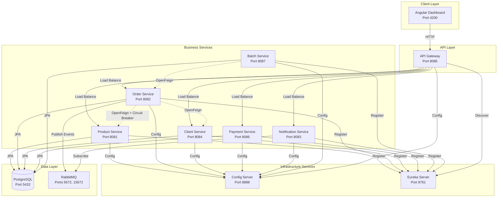
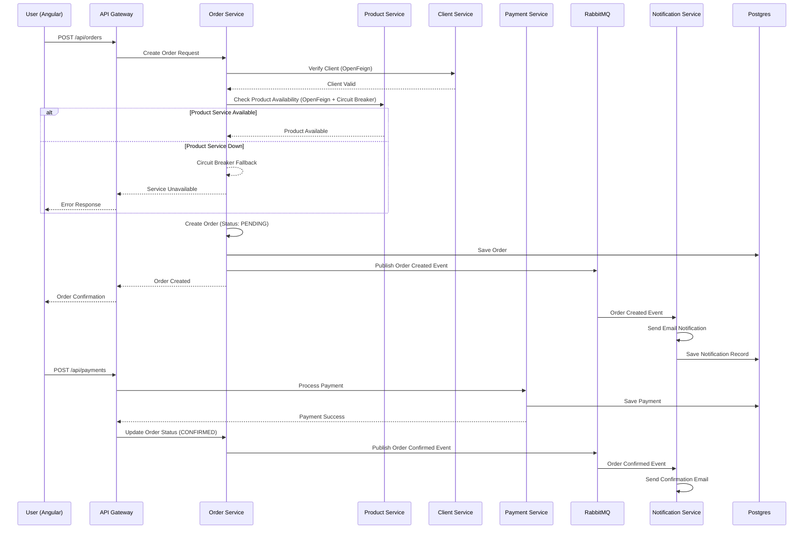

# E-commerce Microservices - Technical Documentation

## 1. Architecture Diagram



## 2. Main API Endpoints

### API Gateway (Port 8085)
All requests go through the gateway with prefix `/api`

### Product Service
- `GET /api/products` - List all products
- `GET /api/products/{id}` - Get product by ID
- `POST /api/products` - Create new product
- `PUT /api/products/{id}` - Update product
- `DELETE /api/products/{id}` - Delete product

### Order Service
- `GET /api/orders` - List all orders
- `GET /api/orders/{id}` - Get order by ID
- `POST /api/orders` - Create new order (triggers notification)
- `PUT /api/orders/{id}` - Update order status (triggers notification)
- `DELETE /api/orders/{id}` - Cancel order

### Client Service
- `GET /api/clients` - List all clients
- `GET /api/clients/{id}` - Get client by ID
- `POST /api/clients` - Register new client
- `PUT /api/clients/{id}` - Update client
- `POST /api/clients/login` - Authenticate client

### Payment Service
- `GET /api/payments` - List all payments
- `GET /api/payments/{id}` - Get payment by ID
- `POST /api/payments` - Process payment
- `GET /api/payments/order/{orderId}` - Get payments for order

### Notification Service
- `GET /api/notifications` - List all notifications
- `GET /api/notifications/client/{clientId}` - Get client notifications

## 3. Order Placement Sequence Diagram



## 4. Spring Batch - Nightly Order Processing

### Batch Job Configuration
- **Service**: batch-service (Port 8087)
- **Schedule**: Nightly at 2:00 AM (configurable via cron expression)
- **Purpose**: Process all PENDING orders in batch

### Batch Job Flow
1. **Reader**: Reads all orders with status = "PENDING" from database
2. **Processor**: 
   - Validates order details
   - Checks product availability via OpenFeign
   - Calculates totals
   - Updates order status to "PROCESSING"
3. **Writer**: Saves processed orders back to database
4. **Notification**: Publishes batch completion event to RabbitMQ

### Configuration
```yaml
spring:
  batch:
    job:
      enabled: true
    jdbc:
      initialize-schema: always
```

### Cron Expression
```java
@Scheduled(cron = "0 0 2 * * *") // Every day at 2 AM
public void runBatchJob()
```

## 5. Notification System

### Architecture
- **Message Broker**: RabbitMQ (Ports 5672, 15672)
- **Publisher**: Order Service
- **Subscriber**: Notification Service
- **Email**: Gmail SMTP (configured in docker-compose)

### Event Types
1. **ORDER_CREATED** - Sent when new order is placed
2. **ORDER_CONFIRMED** - Sent when payment is successful
3. **ORDER_SHIPPED** - Sent when order is dispatched
4. **ORDER_DELIVERED** - Sent when order is delivered
5. **ORDER_CANCELLED** - Sent when order is cancelled

### RabbitMQ Configuration
```yaml
spring:
  rabbitmq:
    host: rabbitmq
    port: 5672
    username: guest
    password: guest
```

### Queue Configuration
- **Queue Name**: `order-notifications`
- **Exchange**: `order-exchange`
- **Routing Key**: `order.#`

### Email Template
```
Subject: Order Status Update - Order #{orderId}

Dear {customerName},

Your order #{orderId} status has been updated to: {status}

Order Details:
- Products: {productList}
- Total: ${total}
- Date: {date}

Thank you for shopping with us!
```

## 6. Resilience Patterns

### Circuit Breaker (Resilience4J)
Implemented in Order Service when calling Product Service

**Configuration:**
```yaml
resilience4j:
  circuitbreaker:
    instances:
      productService:
        slidingWindowSize: 10
        failureRateThreshold: 50
        waitDurationInOpenState: 10s
        permittedNumberOfCallsInHalfOpenState: 3
```

**States:**
- **CLOSED**: Normal operation
- **OPEN**: Service unavailable, requests fail fast
- **HALF_OPEN**: Testing if service recovered

### Fallback Strategy
When Product Service is unavailable:
1. Return cached product data (if available)
2. Allow order creation with manual verification flag
3. Queue order for later processing

## 7. Service Discovery

All services register with Eureka Server on startup:
- **Eureka Dashboard**: http://localhost:8761
- **Health Check Interval**: 30 seconds
- **Lease Renewal Interval**: 30 seconds

## 8. Configuration Management

Centralized configuration via Config Server:
- **Config Server**: Port 8888
- **Profile**: native (file-based)
- **Location**: `/config-repo` directory
- **Refresh**: Dynamic refresh supported via Spring Cloud Bus (optional)
